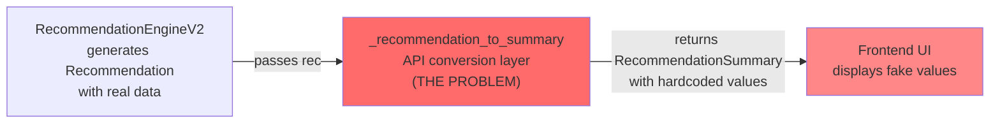

# API/Frontend Audit: Quick Reference

**Executive Summary:** 9 computed fields never reach API/UI, 4 critical fields hardcoded to fake values.

---

## The 4 Critical Hardcoded Fields (UI Shows Fake Data)



| Field | Currently | Should Be | Data Source | Status |
|-------|-----------|-----------|-------------|--------|
| `implementation_effort` | `"Medium"` | High/Medium/Low | Estimate from scope + action type | Hardcoded |
| `impact_level` | `"Medium"` | High/Medium/Low | Compute from estimated_delay_reduction | Hardcoded |
| `category` | `None` | Blocker category | Lookup blocker.category | Hardcoded |
| `baseline_probability` | `0.0` | 0.25-0.75 | `upstream.monte_carlo.on_time_probability` | **Already computed** but discarded |
| `baseline_delay_days` | `0.0` | 5-30 | `upstream.forecast.expected_delay_days` | **Already computed** but discarded |
| `baseline_risk_score` | `0.0` | 10-90 | `upstream.risk_result.overall_risk_score` | **Already computed** but discarded |
| `after_probability` | `0.0` | 0.3-0.8 | Estimate or simulate | Needs work |
| `after_delay_days` | `0.0` | 3-20 | Estimate or simulate | Needs work |
| `after_risk_score` | `0.0` | 5-80 | Estimate or simulate | Needs work |

---

## The 9 Unused Computed Fields

### In SimulationResult (Computed But Never Returned)
```python
# File: app/engines/recommendations/models.py lines 169-182
# These are computed by SimulationEngineV2._compute_result() but:

seed_used: int                          # ← COMPUTED (line 290) but not returned to API
is_positive_impact: bool                # ← COMPUTED (line 291) but not returned to API
summary: str                            # ← COMPUTED (line 294) but not returned to API

# Per-category metrics (also computed, never used)
baseline_metrics.schedule_risk: float   # ← Computed but never forwarded
baseline_metrics.resource_risk: float   # ← Computed but never forwarded
simulated_metrics.schedule_risk: float  # ← Computed but never forwarded
simulated_metrics.resource_risk: float  # ← Computed but never forwarded
```

### In Recommendation.impact_evidence (Computed But Dropped at API)
```python
# File: app/engines/recommendations/models.py line 120
impact_evidence: List[SignalEvidence]  # ← Computed by ImpactEstimator
                                       # ← Never included in API response details
```

### Orphaned Models (Never Used)
```python
# File: app/api/models_phase3.py lines 379-385
class RecommendationResult:  # ← Defined but never imported or used anywhere
    baseline_probability: float
    baseline_delay_days: float
    baseline_risk_score: float
    recommendations: List[RecommendationSummary]
```

---

## Data Flow: Current vs. Desired

### CURRENT FLOW (Broken)
```
┌─────────────────────────────────────────────────────────────┐
│ RecommendationEngineV2.generate()                            │
│  ↓                                                            │
│ Recommendation {                                             │
│   • recommendation_id: "abc123"  ✓                          │
│   • title: "Resolve Database Blocker"  ✓                    │
│   • estimated_delay_reduction_days: 8.2  ✓                 │
│   • estimated_risk_reduction: 12.4  ✓                      │
│   • affected_blocker_ids: ["b1", "b2"]  ✓                  │
│   • impact_evidence: [SignalEvidence...]  ← COMPUTED       │
│   • action_type: RESOLVE_BLOCKER  ✓                        │
│ }                                                            │
└─────────────────────────────────────────────────────────────┘
                           ↓
        _recommendation_to_summary(rec)
        [API CONVERSION LAYER]
                           ↓
┌─────────────────────────────────────────────────────────────┐
│ RecommendationSummary {                                      │
│   recommendation_id: "abc123"  ✓                             │
│   action: "Resolve Database Blocker"  ✓                      │
│   priority_score: 75  ✓                                      │
│   confidence: "High"  ✓                                      │
│                                                              │
│   ❌ HARDCODED / DROPPED:                                    │
│   • implementation_effort: "Medium"  [Should vary]          │
│   • impact_level: "Medium"  [Should vary]                   │
│   • category: None  [Should be "Technical Debt"]            │
│   • baseline_probability: 0.0  [Should be 0.34]            │
│   • baseline_delay_days: 0.0  [Should be 18.5]             │
│   • baseline_risk_score: 0.0  [Should be 62.4]             │
│   • expected_*: 0.0  [Should be computed]                   │
│   • details.impact_evidence: []  [Computed but dropped]     │
│ }                                                            │
└─────────────────────────────────────────────────────────────┘
                           ↓
              RecommendationResponse
                           ↓
           ┌─────────────────────────────┐
           │ Frontend UI                 │
           │ Displays fake values: :(    │
           └─────────────────────────────┘
```

### DESIRED FLOW (After Fixes)
```
┌──────────────────────────────────────┐
│ RecommendationEngineV2._compute_upstream()
│  ↓
│ UpstreamEngineOutputs {
│   monte_carlo.on_time_probability: 0.34
│   forecast.expected_delay_days: 18.5
│   risk_result.overall_risk_score: 62.4
│ }
└──────────────────────────────────────┘
          ↓ (cached, passed to API)
┌──────────────────────────────────────┐
│ _recommendation_to_summary(rec, baseline)
│  ↓
│ RecommendationSummary {
│   ✓ implementation_effort: compute_from(scope)
│   ✓ impact_level: compute_from(estimated_delay)
│   ✓ category: resolve_from(blocker_ids)
│   ✓ baseline_probability: 0.34
│   ✓ baseline_delay_days: 18.5
│   ✓ baseline_risk_score: 62.4
│   ✓ details.impact_evidence: [signals]
│ }
└──────────────────────────────────────┘
           ↓
    Frontend UI displays REAL DATA ✓
```

---

## File Locations Map

| Issue | File | Lines | Status |
|-------|------|-------|--------|
| Hardcoded baseline 0.0 | `app/api/routes/recommendations.py` | 53-65 | **CRITICAL** |
| Hardcoded "Medium" (effort) | `app/api/routes/recommendations.py` | 51 | **CRITICAL** |
| Hardcoded "Medium" (impact) | `app/api/routes/recommendations.py` | 62 | **CRITICAL** |
| Hardcoded None (category) | `app/api/routes/recommendations.py` | 69 | **HIGH** |
| Unused impact_evidence | `app/api/routes/recommendations.py` | 48-53 | **HIGH** |
| Unused audit fields | `app/engines/recommendations/models.py` | 169-182 | **MEDIUM** |
| Orphaned RecommendationResult | `app/api/models_phase3.py` | 379-385 | **LOW** |
| GET endpoint (no baseline pass) | `app/api/routes/recommendations.py` | 94-102 | **CRITICAL** |

---

## Before/After API Response Examples

### GET /api/recommendations?session_id=abc&top_n=1

#### BEFORE (Current — Fake Data)
```json
{
  "success": true,
  "data": {
    "session_id": "abc",
    "project_name": "Project X",
    "recommendations": [
      {
        "recommendation_id": "rec_001",
        "type": "Resolve Blocker",
        "action": "Resolve Database Blocker",
        "implementation_effort": "Medium",           // ← HARDCODED
        "impact_level": "Medium",                    // ← HARDCODED
        "category": null,                            // ← HARDCODED
        "baseline_probability": 0.0,                 // ← HARDCODED
        "after_probability": 0.0,                    // ← HARDCODED
        "expected_probability_gain": 0.0,            // ← HARDCODED
        "baseline_delay_days": 0.0,                  // ← HARDCODED
        "after_delay_days": 0.0,                     // ← HARDCODED
        "expected_delay_gain_days": 8.2,
        "baseline_risk_score": 0.0,                  // ← HARDCODED
        "after_risk_score": 0.0,                     // ← HARDCODED
        "expected_risk_reduction": 12.4,
        "details": {
          "affected_item_ids": ["item_1"],
          "affected_blocker_ids": ["blocker_1"],
          // impact_evidence is MISSING
        }
      }
    ]
  }
}
```

#### AFTER (Fixed — Real Data)
```json
{
  "success": true,
  "data": {
    "session_id": "abc",
    "project_name": "Project X",
    "recommendations": [
      {
        "recommendation_id": "rec_001",
        "type": "Resolve Blocker",
        "action": "Resolve Database Blocker",
        "implementation_effort": "High",             // ← COMPUTED from scope
        "impact_level": "High",                      // ← COMPUTED from delay reduction
        "category": "Technical Debt",                // ← RESOLVED from blocker lookup
        "baseline_probability": 0.34,                // ← FROM UPSTREAM
        "after_probability": 0.52,                   // ← ESTIMATED or simulated
        "expected_probability_gain": 0.18,
        "baseline_delay_days": 18.5,                 // ← FROM UPSTREAM
        "after_delay_days": 10.3,                    // ← ESTIMATED or simulated
        "expected_delay_gain_days": 8.2,
        "baseline_risk_score": 62.4,                 // ← FROM UPSTREAM
        "after_risk_score": 50.0,                    // ← ESTIMATED or simulated
        "expected_risk_reduction": 12.4,
        "details": {
          "affected_item_ids": ["item_1"],
          "affected_blocker_ids": ["blocker_1"],
          "impact_evidence": [                       // ← NOW INCLUDED
            {
              "signal_id": "sig_001",
              "signal_type": "blocker_velocity_impact",
              "confidence": "High",
              "details": {"blocker": "blocker_1", "hours_lost": 40}
            }
          ]
        }
      }
    ]
  }
}
```

### POST /api/recommendations/simulate

#### BEFORE (Current — Missing Audit Fields)
```json
{
  "simulation_result": {
    "baseline_probability": 0.34,
    "after_probability": 0.52,
    "probability_gain": 0.18,
    "baseline_delay_days": 18.5,
    "after_delay_days": 10.3,
    "delay_reduction_days": 8.2,
    "baseline_risk_score": 62.4,
    "after_risk_score": 50.0,
    "risk_reduction": 12.4,
    // seed_used, is_positive_impact, summary NOT INCLUDED
  }
}
```

#### AFTER (Fixed — Includes Audit Fields)
```json
{
  "simulation_result": {
    "baseline_probability": 0.34,
    "after_probability": 0.52,
    "probability_gain": 0.18,
    "baseline_delay_days": 18.5,
    "after_delay_days": 10.3,
    "delay_reduction_days": 8.2,
    "baseline_risk_score": 62.4,
    "after_risk_score": 50.0,
    "risk_reduction": 12.4,
    "seed_used": 42,                            // ← NEW: Reproducibility audit
    "is_positive_impact": true,                 // ← NEW: Impact classifier
    "summary": "Applied 1 recommendation; on-time probability delta=0.1800"  // ← NEW: Human summary
  }
}
```

---

## Implementation Roadmap

| Priority | Fix | Effort | Time | Status |
|----------|-----|--------|------|--------|
| 1 | Route baseline metrics (Fix #1) | Low | 30min | 🔴 TODO |
| 2 | Compute impact_level (Fix #2) | Low | 15min | 🔴 TODO |
| 3 | Resolve category (Fix #3) | Low | 20min | 🔴 TODO |
| 4 | Estimate implementation_effort (Fix #4) | Low | 20min | 🔴 TODO |
| 5 | Expose impact_evidence (Fix #5) | Low | 15min | 🔴 TODO |
| 6 | Expose audit fields (Fix #6) | Medium | 25min | 🔴 TODO |
| 7 | Remove dead code (Fix #7) | Low | 5min | 🔴 TODO |
| | **TOTAL** | **Medium** | **2.5 hours** | |

---

## Key Insights

### Why This Happened
1. **Separation of concerns failure** — API layer didn't integrate with engine output structure
2. **Placeholder values left in** — "Medium", "0.0", `None` were defaults during development
3. **Baseline not wired** — Upstream computation exists but wasn't passed to API layer
4. **Evidence not forwarded** — Impact_evidence computed but forgotten in API response schema

### Impact on Users
- **Decision Quality**: Fake effort/impact values make prioritization meaningless
- **Trust**: "0.0" baseline probability suggests system doesn't work
- **Explainability**: No evidence chain visible, users can't understand why recommendation is suggested
- **Audit Trail**: Can't verify determinism (seed_used not visible)

### Risk of Not Fixing
- UI continues showing nonsense values
- Users trust recommendations less
- Missed opportunity to expose computed insights
- Audit trail incomplete

---

## Testing Commands

```bash
# Show current fake values (all 0.0 or "Medium")
curl -s http://localhost:8000/api/recommendations?session_id=test | \
  jq '.data.recommendations[0] | {
    baseline_probability,
    baseline_delay_days,
    baseline_risk_score,
    implementation_effort,
    impact_level,
    category
  }'

# Expected (BEFORE): {"baseline_probability":0,"baseline_delay_days":0,"baseline_risk_score":0,"implementation_effort":"Medium","impact_level":"Medium","category":null}

# Expected (AFTER): {"baseline_probability":0.34,"baseline_delay_days":18.5,"baseline_risk_score":62.4,"implementation_effort":"High","impact_level":"High","category":"Technical Debt"}
```

---

**See:** [AUDIT_FIXES_IMPLEMENTATION_GUIDE.md](AUDIT_FIXES_IMPLEMENTATION_GUIDE.md) for detailed code changes
